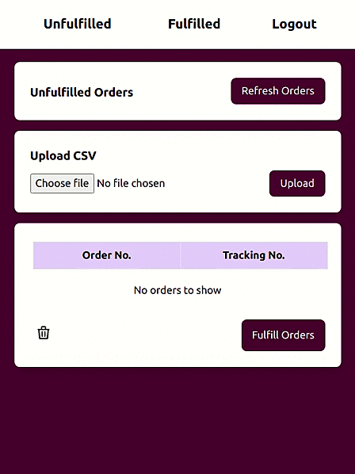
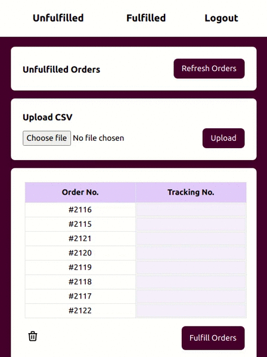

# 📦📦 Squarespace Order Fulfillment 📦📦

## About the project
An app for my sisters small e-commerce company to reduce manual data entry for fulfilling their orders.

## What it does  
1. Pulls down unfulfilled orders from their Squarespace site
2. Allows them to upload the fulfillent companies CSV containing order tracking IDs
3. Orders are matched up with their corresponding tracking IDs
4. Orders are then marked as fulfilled on Squarespace, sending a confirmation email to their customers 

## Features
1. Authenticated user login
2. Orders stored in mySQL database
3. Integrated with the Squarespace API

## Demo
### Refreshing Orders

### Uploading CSV

## Built with 
* [Laravel](https://laravel.com)
* [TailwindCSS](https://tailwindcss.com/)

